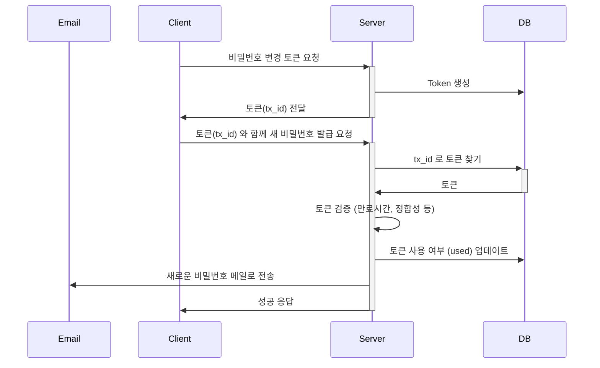

```mermaid
sequenceDiagram
    participant Email
    participant Client
    participant Server
    participant DB
    Client->>+Server: 비밀번호 변경 토큰 요청
    Server->>DB: Token 생성
    Server->>-Client: 토큰(tx_id) 전달
    Client->>+Server: 토큰(tx_id) 와 함께 새 비밀번호 발급 요청
    Server->>+DB: tx_id 로 토큰 찾기
    DB->>-Server: 토큰
    Server->>Server: 토큰 검증 (만료시간, 정합성 등)
    Server->>DB: 토큰 사용 여부 (used) 업데이트
    Server->>Email: 새로운 비밀번호 메일로 전송
    Server->>-Client: 성공 응답
```
